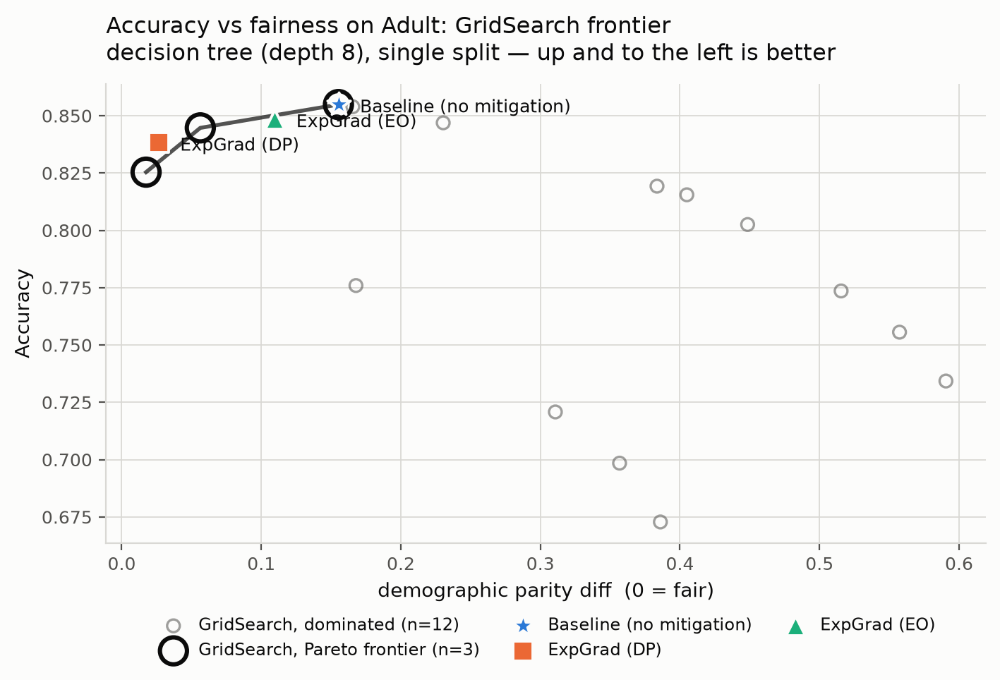

# Algorithmic (In-Processing) Bias Mitigation on Adult Census Income

Detection and mitigation of algorithmic bias in an income-prediction classifier
using **purely in-processing** fairness methods — the training data is never
modified, only the optimisation problem given to the learner.

Course project for a Responsible AI class. The full specification is in
[`INITIATION_DOC.md`](INITIATION_DOC.md).

> **📖 Full write-up of every result is in [`docs/`](docs/README.md)** — eight
> documents covering setup, the base-paper reproduction, the ablation, and three
> analyses that go beyond the specification, each compared against the base paper.

## Headline

**The base paper's method works exactly as claimed, and confirming that is only half
the story.** Agarwal et al.'s reduction takes demographic parity difference from 0.161
to 0.019 — an 88% reduction — for 1.5 accuracy points, on any base classifier, without
touching the training data. Every claim it makes held up.

What the fairness metric does not say is *how* it got there:

| | Finding | Where |
|---|---|---|
| 1 | **Every mitigation shrank the pie.** All five reduced the total number of favourable decisions, by 8–22%. None closed the gap primarily by lifting the disadvantaged group. ExpGrad-DP: 909 men lost approval so 316 women could gain it. | [docs/05](docs/05-who-pays.md) |
| 2 | **Rates and people disagree.** In rates the burden looks split ~50/50; in people it is ~2.7 lost per 1 gained, because the privileged group is 2.1× larger. | [docs/05](docs/05-who-pays.md) |
| 3 | **62% of ExpGrad-EO's individual-level effect is a coin flip** — two draws from the *same fitted model* disagree on 3.2% of subjects against a 5.2% total change. | [docs/05](docs/05-who-pays.md) |
| 4 | **The fairest models use sex proxies *more*.** `sex` is absent from the features, yet ExpGrad-DP raises proxy reliance 9.7% over the unmitigated baseline and both DP methods **doubled** their use of `relationship` (+108%). To equalise rates without reading sex, the model must first infer it. | [docs/06](docs/06-proxy-reliance-shap.md) |
| 5 | **Fixing sex leaves a 9× larger gap at Sex × Race** (0.020 vs 0.178), and moves the worst-off subgroup from Black women to **Black men** — protected by no constraint at all. | [docs/07](docs/07-intersectional.md) |
| 6 | **Half the intersectional subgroups cannot be measured.** 5 of 10 are too small; one has zero positive labels, making its TPR undefined by division. 70% of the apparent gap in the intersectional arm comes from those cells. | [docs/07](docs/07-intersectional.md) |

Nothing above contradicts the base paper — all six sit outside its frame. The two
predictions that *were* refuted came from this project's own initiation document; see
[docs/08](docs/08-vs-base-paper.md).

## Status

| Component | State |
|---|---|
| Dataset interface + Adult loader | Implemented |
| Fairness metrics (DP diff, EO diff, disparate impact) | Implemented, cross-checked against `fairlearn` |
| Multi-seed baseline experiment | Implemented |
| Exponentiated Gradient (DP / EO constraints) | Implemented — base-paper deliverables 1–3 |
| GridSearch Pareto frontier | Implemented — base-paper deliverable 4 |
| Prejudice Remover (Kamishima 2012) | Implemented from scratch (PyTorch), 4/4 tests |
| Adversarial Debiasing (Zhang et al. 2018) | Implemented from scratch (PyTorch), 4/4 tests |
| Full ablation table | Implemented |
| Who-pays / levelling-down incidence analysis | Implemented, 8/8 tests — **beyond spec** |
| SHAP proxy-reliance analysis | Implemented — spec stretch goal |
| Intersectional Sex × Race analysis | Implemented — **beyond spec** |

## The problem

Predict whether income exceeds $50K/yr from US census features. The protected
attribute is `sex`.

Standard ERM minimises `E[1{h(x) != y}]` with no reference to the protected
attribute `a`. But the base rates differ sharply across groups, so the model
reproduces that gap through correlated features. The project instead solves

```
min_h  E[1{h(x) != y}]   subject to   φ(h) <= ε
```

where `φ` is a fairness violation measure. The dataset `D` is untouched; only the
feasible region changes.

## Quickstart

```bash
python3 -m venv .venv && source .venv/bin/activate
pip install -r requirements.txt

python -m src.experiments.run_baseline                       # 5 seeds, both models
python -m src.experiments.run_baseline --include-protected   # give the model `sex`

python -m src.experiments.run_mitigation --seeds 0 1 2 3 4   # baseline + ExpGrad DP/EO
python -m src.experiments.run_pareto                         # GridSearch frontier (DP)
python -m src.experiments.run_pareto --constraint equalized_odds
python -m src.experiments.run_ablation --seeds 0 1 2 3 4     # all six methods

# Analyses beyond the specification
python -m src.experiments.run_who_pays --seeds 0 1 2 3 4     # levelling up vs down
python -m src.experiments.plot_who_pays                      # incidence chart
python -m src.experiments.run_shap --seed 0                  # proxy reliance
python -m src.experiments.run_intersectional --seeds 0 1 2   # Sex x Race
```

Correctness checks:

```bash
python -m tests.test_inprocessing   # the from-scratch method implementations (4/4)
python -m tests.test_incidence      # the who-pays decomposition (8/8)
```

Adult is downloaded from OpenML on first run and cached to `data/`.

## Baseline results

Unmitigated ERM, 30% test split, mean over 3 seeds, **protected attribute excluded
from the features**:

| Model | Accuracy | DP diff ↓ | EO diff ↓ | Disparate impact →1 |
|---|---|---|---|---|
| Decision tree (depth 8) | 0.852 | 0.156 | 0.080 | 0.306 |
| Logistic regression | 0.847 | 0.190 | 0.106 | 0.290 |

Group base rates: `P(y=1 | Male) = 0.312` vs `P(y=1 | Female) = 0.114`.

Two things worth noting before any mitigation is applied:

1. **Disparate impact is ≈ 0.30**, far below the 0.8 "four-fifths rule" threshold.
   The bias is large, not marginal.
2. **This happens with `sex` removed from the model's inputs.** Fairness through
   unawareness does not work here — `relationship`, `marital-status` and
   `hours-per-week` carry the signal. This is the motivation for in-processing
   methods, and it is worth reporting as a result rather than an aside.

Note also that per-group *accuracy* is higher for the unprivileged group (0.93 vs
0.82) while its selection rate is far lower — a reminder that aggregate accuracy
parity and fairness are different properties.

## Mitigation results

Decision tree (depth 8), mean ± std over 5 seeds. Arrows mark the fair direction.

| Method | Accuracy | DP diff ↓ | EO diff ↓ | Disparate impact →1 |
|---|---|---|---|---|
| Baseline | 0.852 ± 0.003 | 0.161 ± 0.013 | 0.083 ± 0.023 | 0.309 ± 0.032 |
| ExpGrad (DP) | 0.836 ± 0.002 | **0.019 ± 0.007** | 0.277 ± 0.017 | **0.883 ± 0.042** |
| ExpGrad (EO) | 0.847 ± 0.003 | 0.113 ± 0.014 | **0.036 ± 0.024** | 0.457 ± 0.049 |

**The reduction works, and it is cheap.** The DP constraint cuts demographic parity
difference by 88% (0.161 → 0.019) for 1.5 percentage points of accuracy, and lifts
disparate impact from 0.31 to 0.88 — from failing the four-fifths rule badly to
clearing it. The EO constraint cuts equalized-odds difference by 57% for 0.5pp.

**But the two fairness criteria actively conflict.** Constraining demographic parity
makes equalized odds **3.3× worse** than doing nothing at all (0.083 → 0.277). A
model reported only on the metric it was optimised for looks like a clear success;
the same model is the worst of the three on the metric it ignored. This is the
sharpest result so far and it answers ablation question 3 directly — the ranking of
methods depends entirely on which metric you report.

Per-group rates (seed 0) show *how* DP is achieved: the privileged group's TPR falls
0.561 → 0.452 while the unprivileged group's rises 0.479 → 0.707. Parity comes partly
from lifting the disadvantaged group and partly from pulling the advantaged group
down — the decomposition that the "who pays" analysis in Future Work formalises.

### Pareto frontier



Sweeping 15 λ values gives **3 non-dominated models under DP** — the other 12 are
worse on both axes, so the trade-off is much lumpier than a frontier-only plot would
suggest. `ExpGrad (DP)` lands essentially on the frontier, so the game-playing
algorithm buys little over a plain grid *for this constraint*.

Under **equalized odds it is a different story**: only **1 of 15** grid points is
non-dominated, and it is the unmitigated baseline itself (the black ring around the
blue star in `results/pareto_equalized_odds.png`). Every other grid point is worse
than doing nothing on both axes, while `ExpGrad (EO)` reaches 0.849 accuracy at 0.021
EO difference. The default grid simply does not cover the useful λ region when the
constraint has four components (TPR and FPR × two groups) instead of one. Reporting
GridSearch and ExponentiatedGradient as interchangeable "Agarwal et al. 2018" rows
would hide that entirely.

## Ablation: all six methods

Logistic-regression base throughout, mean ± std over 5 seeds. Only the mitigation
mechanism varies; data, base classifier and metrics are held fixed.

| Method | Accuracy | DP diff ↓ | EO diff ↓ | Disparate impact →1 |
|---|---|---|---|---|
| Baseline | 0.847 ± 0.003 | 0.186 ± 0.008 | 0.095 ± 0.030 | 0.300 ± 0.030 |
| ExpGrad (DP) | 0.828 ± 0.002 | 0.018 ± 0.009 | 0.280 ± 0.019 | 0.895 ± 0.052 |
| ExpGrad (EO) | 0.836 ± 0.001 | 0.107 ± 0.010 | **0.032 ± 0.014** | 0.521 ± 0.039 |
| GridSearch (DP) | 0.827 ± 0.007 | **0.015 ± 0.019** | 0.304 ± 0.046 | **0.986 ± 0.138** |
| Prejudice Remover | 0.837 ± 0.002 | 0.065 ± 0.009 | 0.188 ± 0.025 | 0.686 ± 0.037 |
| Adversarial Debiasing | 0.826 ± 0.001 | 0.020 ± 0.009 | 0.250 ± 0.015 | 0.889 ± 0.050 |

### The three ablation questions

**1. Closest to zero bias for the smallest accuracy cost?** These are two different
questions and they have two different answers. *Lowest absolute* demographic parity
difference goes to GridSearch (0.015) and ExpGrad-DP (0.018). But *most efficient* is
Prejudice Remover: it removes 0.122 of DP difference for 1.0 accuracy points — 11.7
points of parity per point of accuracy, against 9.0 for ExpGrad-DP and 7.9 for
Adversarial Debiasing. Prejudice Remover buys the most fairness per unit of accuracy;
it simply stops further along the curve. Reporting only "who got closest to zero"
would hide that.

**2. Most stable across runs?** The initiation document predicted adversarial
training would be the high-variance method. **It is not — it is the most stable one**
(accuracy std 0.0011, the lowest in the table). The unstable method is **GridSearch**:
6× the accuracy variance of the others (0.0070), 2× the DP variance, and a disparate
impact std of 0.138 — nearly 3× anything else. The mechanism explains it. GridSearch
picks one model from a discrete grid by a selection rule, so a small change in the
split can flip which grid point wins and the reported model jumps discontinuously.
That is selection instability, not optimisation instability, and it does not shrink
by training longer.

**3. Does the ranking change with the metric?** Yes, and severely enough to invert
the conclusion. Ranked by demographic parity difference, the order is GridSearch →
ExpGrad-DP → Adversarial → Prejudice Remover → ExpGrad-EO → Baseline. Ranked by
equalized odds difference it becomes ExpGrad-EO → **Baseline** → Prejudice Remover →
Adversarial → ExpGrad-DP → GridSearch.

**Four of the five mitigation methods are worse than no mitigation at all on
equalized odds.** The unmitigated baseline ranks *second of six*. Only the method
that explicitly targets EO beats it. A paper reporting only demographic parity would
present GridSearch as the clear winner; the same model is dead last on the other
criterion, at 0.304 against the baseline's 0.095.

This is not a defect in any of the implementations — it is the documented
incompatibility between parity criteria showing up empirically. It is also the
strongest argument in this project for reporting multiple fairness metrics rather
than the one a method was built to optimise.

## Structure

```
src/
├── datasets/
│   ├── base.py       # FairnessDataset + DatasetLoader interface
│   └── adult.py      # UCI Adult loader, cleaning decisions recorded in notes
├── metrics.py        # DP diff, EO diff, disparate impact, per-group breakdown
├── preprocessing.py  # split + encoding
├── models.py         # base classifiers (must support sample_weight)
├── mitigation.py     # ExponentiatedGradient, GridSearch, Pareto frontier
├── incidence.py      # who-pays decomposition: levelling up vs down
├── explain.py        # SHAP attribution aggregated to source features
├── intersectional.py # multi-group metrics + Wilson intervals + reliability gating
├── inprocessing/
│   ├── prejudice_remover.py      # Kamishima 2012, from scratch
│   └── adversarial_debiasing.py  # Zhang et al. 2018, from scratch
└── experiments/
    ├── methods.py             # the six ablation rows, defined once and shared
    ├── run_baseline.py        # unmitigated reference
    ├── run_mitigation.py      # baseline vs ExpGrad (DP, EO), decision tree
    ├── run_pareto.py          # GridSearch sweep + frontier plot
    ├── run_ablation.py        # all six methods, logistic-regression base
    ├── run_who_pays.py        # incidence analysis
    ├── plot_who_pays.py       # diverging incidence chart
    ├── run_shap.py            # proxy-reliance attribution
    └── run_intersectional.py  # Sex x Race, three arms
tests/
├── test_inprocessing.py  # degenerate-case checks on the from-scratch methods
└── test_incidence.py     # exactness of the who-pays decomposition
docs/                 # the written analysis — start at docs/README.md
results/              # generated tables and figures (.png + .pdf)
```

## Design decisions

Recorded because each is a judgment call a reader could reasonably question.

**Experiments are written against a dataset interface, not against Adult.**
Loaders return a `FairnessDataset`; no experiment references an Adult column name.
This costs little now and is what makes the multi-dataset extension below a loader
swap rather than a rewrite. Only Adult is implemented.

**Two base classifiers are carried, not one.** The initiation document specifies a
decision tree. But Prejudice Remover and Adversarial Debiasing cannot wrap one —
they need a differentiable/linear model by construction. Reporting a tree for some
ablation rows and a linear model for others would vary the hypothesis class *and*
the mitigation simultaneously, so the table would not isolate the effect it claims
to. Logistic regression is therefore carried alongside as the
comparable-across-all-methods base, and the confound is stated rather than hidden.

**Tree depth is capped at 8.** An unbounded tree hits ~100% training accuracy on
Adult, which would confound the accuracy cost of *mitigation* with the accuracy cost
of *overfitting*.

**Encoding is fitted separately from the estimator, not bundled in a `Pipeline`.**
`ExponentiatedGradient` refits its base estimator with `sample_weight`, which a
`Pipeline` will not route to the final step without extra plumbing. Handing the
reduction a bare estimator over pre-encoded arrays keeps the reweight-and-retrain
loop working unmodified. The encoder is still fitted on the training split only.

**Splits are stratified on the `(a, y)` interaction, not on `y` alone.** Fairness
metrics are computed from four cells, the smallest being (Female, >50K). Left
unstratified, that cell's size varies across seeds and injects sampling noise that
is easily mistaken for model instability.

**Metrics are implemented from their definitions and cross-checked against
`fairlearn`** on every run. A privileged/unprivileged orientation slip produces
plausible-looking numbers that are silently wrong; the assertion catches it.

**Every experiment runs over multiple seeds.** One run cannot support a claim about
stability, and stability is one of the questions the ablation asks.

**Within a seed, all methods share one train/test split.** Differences between rows
then come from the mitigation rather than from resampling; the reported standard
deviations come from varying the split across seeds.

**`ExponentiatedGradient.predict` is stochastic and a `random_state` is fixed.** The
reduction returns a distribution over classifiers and samples one per call, so
identical feature vectors can receive different decisions. Fixing the seed makes
results reproducible but does not remove the behaviour — quantifying it is the
stochastic-instability item in Future Work.

**Prejudice Remover and Adversarial Debiasing are implemented from scratch rather
than taken from `aif360`.** Two reasons. The objective and the gradient rule are the
entire content of these papers, so writing them out makes the ablation legible in a
way a library call does not; and `aif360`'s Adversarial Debiasing carries a
TensorFlow-1-compat dependency chain that the rest of this project does not need.
Both are ~130 lines of PyTorch against a linear base model.

**Prejudice Remover needs the protected attribute at prediction time; the others do
not.** Kamishima parameterises the model per group (`σ(w_a · x + b_a)`), so two
applicants identical on every feature but differing in `sex` are scored by different
weight vectors. That is disparate treatment in the legal sense, arrived at while
trying to reduce disparate impact. It is a real qualitative difference between that
row and the rest of the table, not an implementation detail, so `predict` takes `a`
as a required argument to keep the dependency visible.

**The from-scratch methods are verified by degenerate cases, not trusted.**
`tests/test_inprocessing.py` checks that Prejudice Remover at `eta=0` reproduces
per-group logistic regression (99.9% prediction agreement), that raising each
method's fairness knob moves disparity monotonically *down*, and that the adversarial
predictor does not collapse to a constant — which would defeat the adversary
perfectly while scoring 76% on Adult's class imbalance. The monotonicity checks are
the ones that catch a sign error, the failure mode where a "mitigation" increases
disparity while every metric still looks plausible.

**Figure colors were validated, not chosen by eye.** The Pareto plots use three
categorical hues checked against colorblind-separation, lightness and contrast
thresholds for a scatter's all-pairs requirement. The aqua slot falls below 3:1
against the surface, so every reference point carries a direct text label rather than
relying on color; marker shape gives a second, greyscale-safe channel for print. The
grid sweep is drawn in neutral ink because it is a population of models, not a fourth
named series.

## Future work

Not implemented — recorded so the design choices above have visible motivation.

- **Multi-dataset generalisation.** Re-run the identical experiment across ACS /
  `folktables` state slices (Ding et al. 2021, *Retiring Adult*). A single-dataset
  fairness result cannot distinguish a property of the *method* from a property of
  one 1994 census extract. This is what the loader interface exists for.
- **Who pays for the constraint.** Decompose baseline → mitigated prediction flips
  by `(a, y)` cell. A constraint satisfied by lowering the privileged group's true
  positive rate is indistinguishable, at the aggregate metric, from one satisfied by
  raising the unprivileged group's — "levelling down" (Mittelstadt et al. 2023).
  `metrics.group_breakdown` is the starting point.
- **Stochastic-classifier instability.** `ExponentiatedGradient` returns a
  distribution over classifiers, so identical feature vectors can receive different
  decisions on different calls. Quantifying that churn tests whether a group-fairness
  fix introduces an individual-level harm (cf. Cooper et al. 2024 on variance and
  arbitrariness in fair classification).
- **Intersectional constraints.** Enforcing parity on `sex` and on `race`
  separately does not imply parity on `sex × race` (fairness gerrymandering, Kearns
  et al. 2018).
- **Fairness generalisation gap.** Report φ(h) on train *and* test as ε tightens;
  constraints can be satisfied in-sample and violated out-of-sample.

## References

- Agarwal, Beygelzimer, Dudík, Langford & Wallach (2018). *A Reductions Approach to
  Fair Classification.* ICML. — base paper
- Kamishima et al. (2012). *Fairness-Aware Classifier with Prejudice Remover
  Regularizer.*
- Zhang, Lemoine & Mitchell (2018). *Mitigating Unwanted Biases with Adversarial
  Learning.*
- Ding, Hardt, Miller & Schmidt (2021). *Retiring Adult: New Datasets for Fair
  Machine Learning.* NeurIPS.
